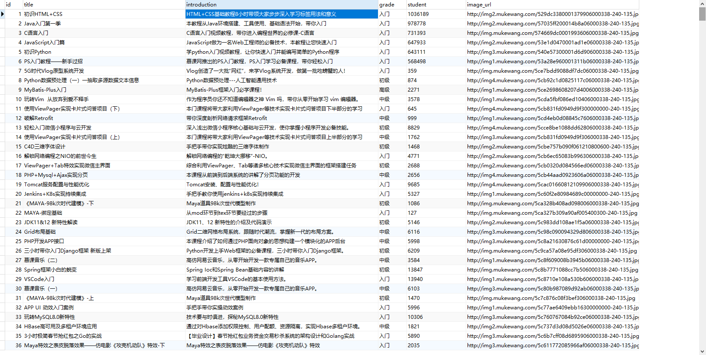

# 爬取慕课网站的课程信息,并存入到MySQL数据库中

## 声明
***该项目只是为了学习，没有其他恶意！***
## 介绍
### 爬取的网站：
--------------------
- 爬取网站的地址：http://www.imooc.com/course/list

### 爬取出的数据样式：
--------------------
- 存入到MySQL数据库的数据样式如下所示：

--------------------
